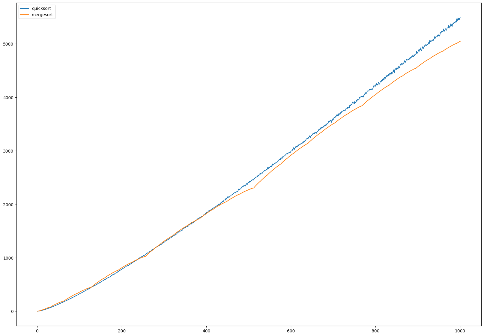

# A Comparative Analysis of Mergesort and Quicksort

Both merge sort and quicksort are efficient sorting algorithms with average time complexities of O(n log n). 
In general, quicksort is faster in practice because it has smaller constant factors and better cache performance. 
However, merge sort is a stable sort, meaning that it preserves the relative order of elements with equal keys, while quicksort is not. 
Additionally, merge sort has the advantage of being easy to parallelize. 
Ultimately, the choice between the two will depend on the specific requirements of the task at hand.

